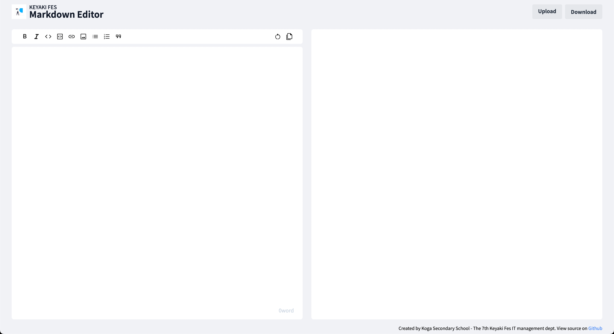

IT 管理部の使用しているサービスでは Markdown 記法を使用するものが多くあります。（Discord、GitHub、本ドキュメントなど）
しかし、Markdown 記法に慣れない生徒が多いことや Markdown をローカル PC に用意する必要があることから、今回独自のマークダウンエディタを作成しました。

[Keyaki Fes Markdown Editor](https://keyaki-fes.github.io/markdown-editor/)

# 概要

Markdown 記法にはさまざまな「方言」がありますが、本エディタでは技術ブログサイトである [zenn](https://zenn.dev) による記法を採用しています。これは、 zenn の開発したパーサーを内部的に使用しているためです。詳細な記法は以下をご覧ください。ただし、zenn 独自の記法として、「コンテンツの埋め込み」が紹介されていますが、現時点では対応していませんので注意してください。

[zenn の記法を解説した記事](https://zenn.dev/zenn/articles/markdown-guide)

画面では入力と同時に生成されたものをプレビューすることができるようになっています。なお、モバイルビューではボタンで切り替える方式になっています。

入力された情報はブラウザの LocalStorage に自動で保存されるため再読み込みを行っても消えることがありません。作成したものは「Download」ボタンからローカルに保存できますし、「Upload」ボタンから読み込むこともできます。

# 技術スタック

フレームワークに Next.js、UI フレームワークとして TailwindCSS を使用しています。
デプロイ先は GitHub Pages であり、GitHub Actions を使用して自動デプロイを実現しています。

Markdown のパースには zenn-markdown-html 、レイアウト調整に zenn-content-css を使用しています。

ソースコードは GitHub にて公開しています。バグ報告や新規機能提案は issue か Discord サーバの `Discussion`チャンネルにお願いします。

[keyaki-fes/markdown-editor](https://github.com/keyaki-fes/markdown-editor)

## 参考資料

- [Next.js 製 個人ブログに zenn-markdown-html と zenn-content-css を導入する](https://zenn.dev/team_zenn/articles/intro-zenn-markdown)
- [zenn-dev/zenn-editor](https://github.com/zenn-dev/zenn-editor)
