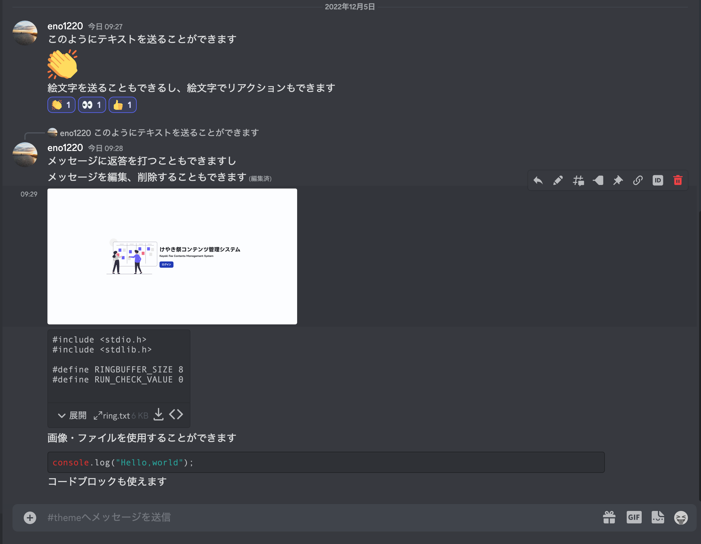
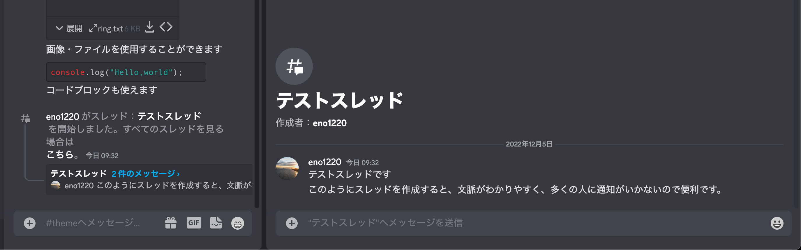
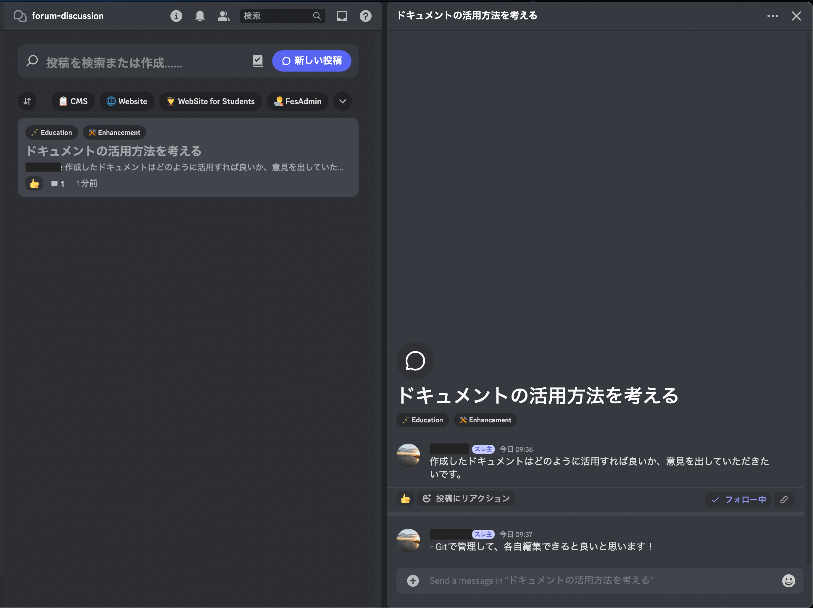

## Discord について

Discord は高機能なボイス＆テキストチャットアプリです。

- PC 版 https://discordapp.com/
- iOS 版 https://itunes.apple.com/jp/app/discord/id985746746
- Android 版 https://play.google.com/store/apps/details?id=com.discord&hl=ja

Discord にログインすれば、どのプラットフォームでも同じアカウントを使えます。また、どのプラットフォームでも同じサーバーにアクセスできます。

Discord のコミュニティは「サーバー」と呼ばれるチャンネルの集合体から形成されます。サーバーは誰でも無料で使用することができ、また自由に参加できます（ただし、一人の参加できるサーバの上限は 100、課金すると 200）。

「チャンネル」はサーバーの中に作成することができ、主に「テキストチャンネル」と「ボイスチャンネル」があります。テキストチャンネルでは、メッセージの投稿・画像などのファイルの送信が可能です。ボイスチャンネルでは、音声・ビデオ通話や画面共有をすることができます。以下の画像を参照してください。

テキストチャンネルではスレッドを立てることができます。スレッドを使用すると、会話に参加している人以外には通知が飛ばない、文脈がわかりやすい、会話を遮らない、などのメリットがありますので、適宜使用すると良いでしょう。

「フォーラムチャンネル」は、スレッド形式でテーマごとに会話を行うことができる新機能です。掲示板のように使うことができます。

## 設定

適宜、自分に合わせた設定をすることをお勧めします。なお、重要な内容を送信するチャンネルは通知を切らないようお願いします。
詳細は、[こちら](https://support.discord.com/hc/ja/categories/200404358)をご覧ください。

なお、Discord ではサーバーごとにユーザー名を変更することができます。IT 管理部のサーバーでは、わかりやすいユーザー名を設定するようにご協力ください。

## ロール

Discord ではサーバーに参加するユーザーごとにロールを決定することができます。例として、IT 管理部では以下のようなロールをとっています。

- `member` : IT 管理部メンバー
- `admin` : IT 管理部の管理者
- `observer` : 文化祭実行委員会メンバー
- `ob` : OB 生徒

ロールごとにチャンネルの閲覧可否を設定したり、チャンネルへの投稿を許可・拒否をしたりすることができます。なお、特定のロールを持ったユーザーのみ閲覧できるチャンネルを「プライベートチャンネル」と呼びます。

## コミュニティ機能

コミュニティ機能はサーバー設定で設定できるサーバーの種類です。
コミュニティ機能を ON にすると、ルールを公開するチャンネルや、フォーラムチャンネル、アナウンスチャンネルを使用できるようになる他、「ようこそ画面」の設置、「イベント開催予告」などをすることができるようになります。
なお、IT 管理部サーバーではコミュニティ機能を ON にしています。
