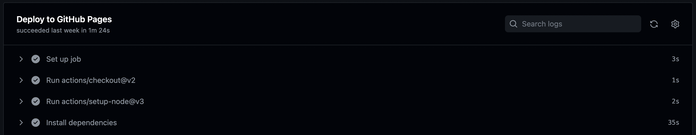
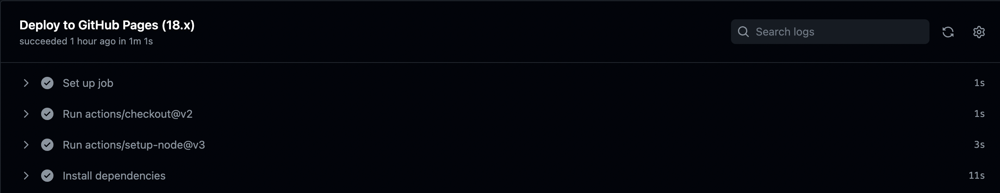

GitHub Actions 上で web サイトを build して GitHub Pages などへデプロイする際、実行するごとに依存パッケージを fetch しているため、実行時間が伸びる傾向にあります。
今回は GitHub Actions でキャッシュを使用し workflow を高速化する手法を紹介します。

## 概要

```yml
jobs:
  deploy:
    name: Deploy to GitHub Pages
    runs-on: ubuntu-latest
    strategy:
      matrix:
        node-version: [18.x]
    steps:
      - uses: actions/checkout@v2
      - uses: actions/setup-node@v3
        with:
          node-version: ${{ matrix.node-version }}
          cache: yarn
          cache-dependency-path: ./package-lock.json

      - name: Install dependencies
        run: yarn install --frozen-lockfile --prefer-offline
      - name: Build website
        run: yarn build
```

まず`actions/setup-node@v2`以降（上記では`@v3`を使用）には依存関係をキャッシュしたり復元したりする機能が組み込まれているのでこちらを利用します。
ここではパッケージマネージャとして`yarn`を指定し、依存ファイルとして`package-lock.json`を指定しています。
こうすることで`package-lock.json`へ変更があった時以外はキャッシュされたデータを使用できるようになるはずです。

次に`yarn install`に`--prefer-offline`オプションを指定します。
これは、依存パッケージをサーバーからダウンロードする代わりに、インストール中に可能な限りキャッシュされたダウンロード（キャッシュディレクトリにある）を使用するようにするためのものです。

## 採用例

実際に上記の workflow はこのサイトをビルドする際に使用されており、キャッシュを利用する前と後では依存パッケージのダウンロードに要する時間がおよそ 1/3 にまで減少しました。（35 秒 → 11 秒）




[実装例](https://github.com/keyaki-fes/documents/blob/80c65e01f61de30c383dfb61a04aed8c05243e7f/.github/workflows/deploy.yml)
