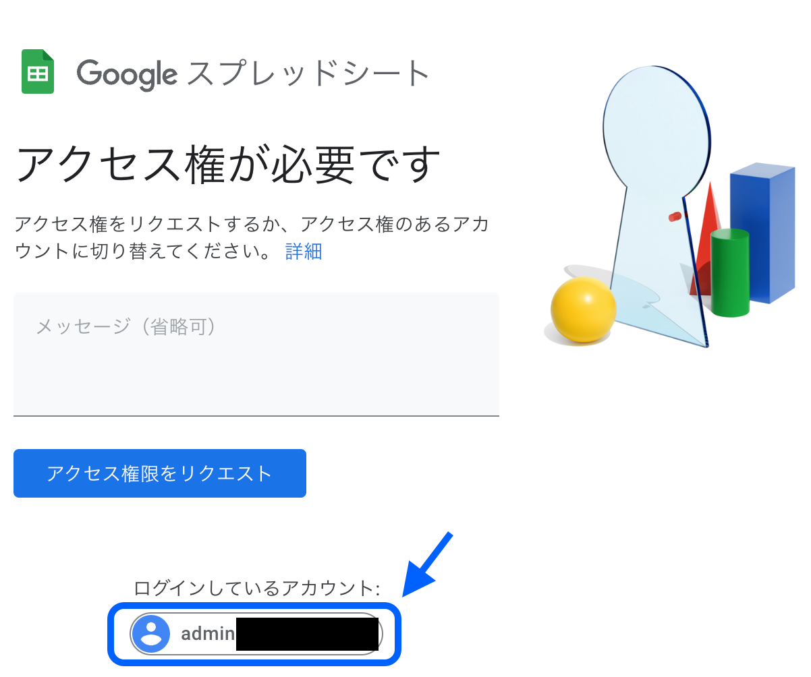

Google Drive で共有されたファイルの URL を開くと上記画像のように「アクセス権が必要です」と表示されることはないでしょうか?
この場合の対処法を紹介します。

## 学校のアカウントでログインする

画像下部に「ログインしているアカウント」と表示さていると思います。
この表示が学校から提供されているアカウント（`@koga-cs.ibk.ed.jp`で終わるアカウント）でなく「アクセス権が必要です」と表示されている場合、ファイルの管理者が閲覧できるアカウントを制限していることが考えられます。

この場合は、画像の青で囲われた部分をクリックし、アカウント選択画面に移動します。

移動すると、選択できるアカウントが表示されています。
学校のアカウントを選択して再度試してみましょう。
学校のアカウントが表示されていない場合、「別のアカウントを使用」から学校のアカウントのメールアドレス、パスワードを入力してください。

## 管理者の方へ

「アクセス権が必要です」と表示されている、と連絡があった場合、まずこちらのドキュメントの URL を送付してください。
また、アクセス権が適切に設定されているか再度確認をお願いします。（ファイルが公開設定になっているか、URL を送信したユーザが共有範囲に指定されているか、など）

アクセス権に関しては、[こちら](./google-drive-sharing)の記事を参考にしてください。
