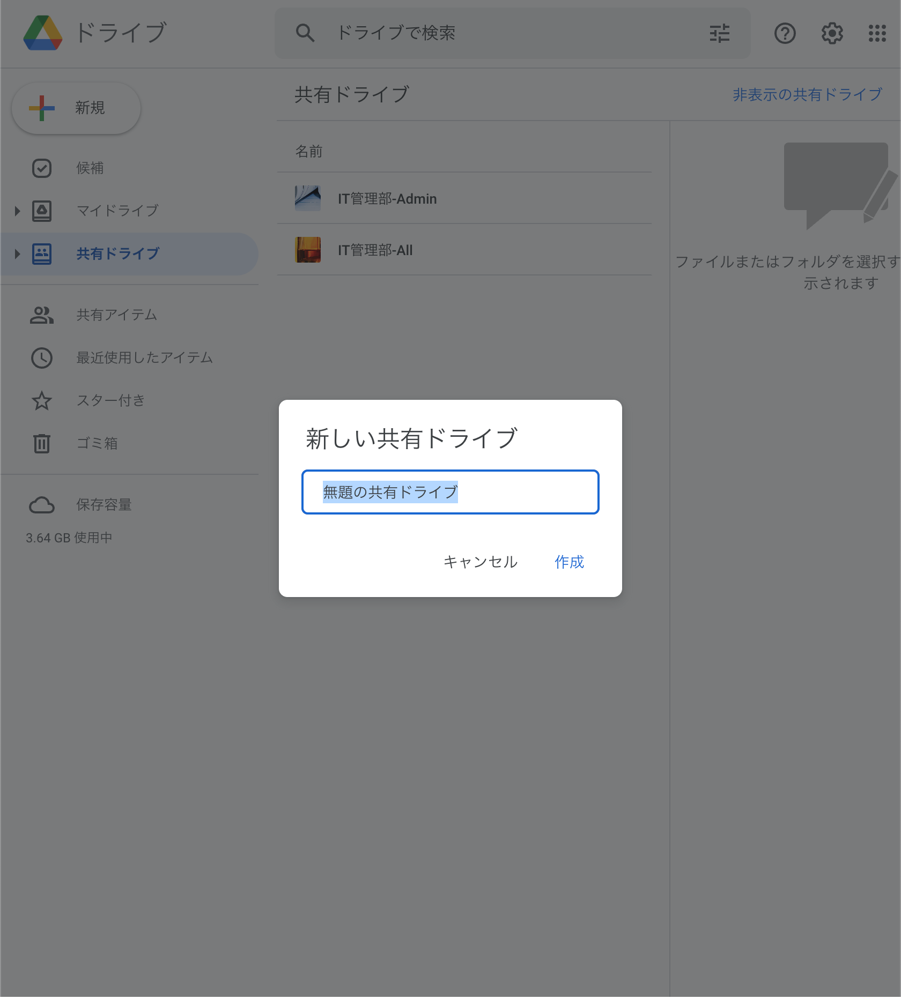

## 共有ドライブとは

> 共有ドライブは Google ドライブ内にある特別なフォルダです。このフォルダをチームで利用してファイルを保存、検索したり、ファイルにアクセスしたりできます。共有ドライブ内のファイルは、個人ではなくチームが所有します。メンバーがチームを去ってもファイルは共有ドライブ内に残るため、どこにいてもどのデバイスからでも、チームで引き続き情報を共有して仕事を進めることができます。
> [引用元](https://support.google.com/a/users/answer/7212025?hl=ja)

このように、チームでファイルを共有するのに便利な機能です。
部署内やクラス内で多数のファイルを共有しておきたい場合などに便利です。
また、学校を卒業後もファイルが残存するため、引き継ぎなどにも便利でしょう。

### 新規作成

共有ドライブを新規作成するには、左側のタブの「共有ドライブ」を選択した状態（背景は青色）で「新規」ボタンをクリックします。

メンバーの追加は右上にある「メンバーを管理」から行います。
ファイルの共有と同様な方法で、メンバーにしたいユーザのメールアドレスを入力して権限を選択します。
権限は以下の通りです。適切に設定をしましょう。

- 管理者 : 全ての操作を行うことができる
- コンテンツ管理者 : ドライブ内のコンテンツに関して全ての操作を行える
- 投稿者 : コンテンツの作成、編集が可能（移動・削除は不可）
- 閲覧者（コメント可） : 閲覧とコメント可
- 閲覧者 : 閲覧が可能

なお、学校から提供される Google アカウントを持っていないユーザにも共有することができます。（権限には十分留意してください。）

メンバーを選択し「共有」をするとユーザにメールが届くので、そちらから参加します。

### 使い方

使い方は従来のドライブと変わりません。ファイルごとに「共有」をしなくても共有ドライブに所属する全てのユーザが閲覧できます。

ファイル・フォルダごとに共有するユーザを追加（共有ドライブに所属しない）することができるため、一部のファイルやフォルダのみにアクセスさせたいユーザはこの手段を使用してください。共有方法は従来のファイルやフォルダを共有するのと変わりません。
