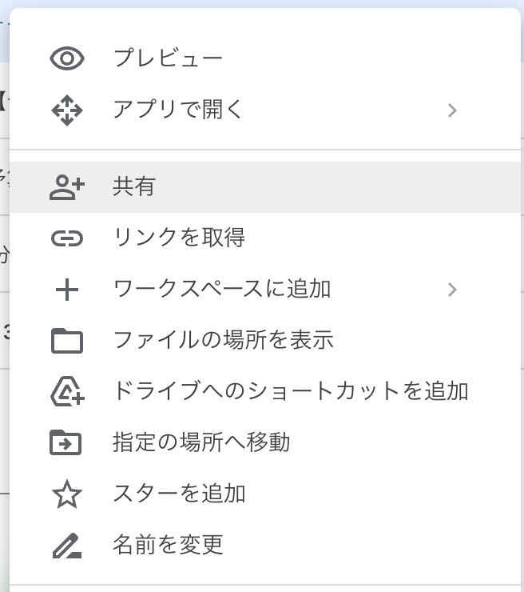
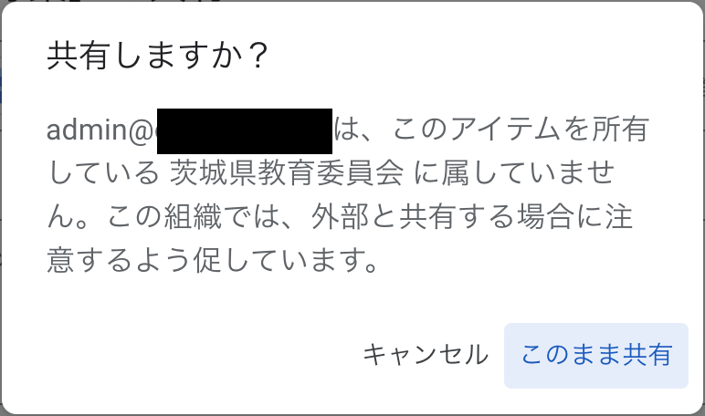

```mdx-code-block
import Tabs from "@theme/Tabs";
import TabItem from "@theme/TabItem";
```

## はじめに

Google Drive に保存しているファイルやフォルダは、他のユーザと共有をすることができます。
なお、アカウントによっては他のユーザとの共有が制限されている場合もあります。

## 共有方法

### ファイルを共有する

ファイル共有の最初の手順として、いくつかの方法があります。

```mdx-code-block
<Tabs>
<TabItem value="file" label="ファイルから共有する" default>
```

この方法は、Google ドキュメント、スプレッドシート、スライドから可能です。<br/>
これらのファイルを開いて右上にある「共有」ボタンを押すことで以下の手順で共有をすることができるようになります。


```mdx-code-block
</TabItem>
<TabItem value="exploler" label="Driveから共有する">
```

この方法は、どの種類のファイルからでも可能です。<br/>
Google Drive にアクセスし、共有したいファイルを左クリックします。
クリックしたら出現するモーダルの「共有」ボタンを押すことで、以下の手順で共有をすることができるようになります。


```mdx-code-block
</TabItem>
</Tabs>
```

次に、共有したい相手のメールアドレスを入力します。


この際に、共有相手の権限を指定することができ、「閲覧者」、「閲覧者（コメント可）」、「編集者」の 3 つから選択をすることができます。適切な権限を指定してください。

共有をすると、相手のメールアドレスにメールが届くので、メールから参加するか、LINE や Discord 等を使用してファイルの URL を相手に送信することで共有を完了できます。


モーダル下部の「一般的なアクセス」より、ファイルの公開範囲を指定できます。

「茨城県教育委員会」と「リンクを知っている全員」が指定でき、「茨城県教育委員会」の場合は生徒・教員全体に、「リンクを知っている全員」は制限なしにリンクを知っている場合アクセスすることができます。

こちらでも共有相手の権限を指定することができるので適宜選択してください。

:::warning

「リンクを知っている全員」を選択すると、リンクが意図しないユーザに共有された場合、当然内容を閲覧できてしまいます。個人情報などを含む場合にはこちらを選択しないようにしてください。

:::

なお、「茨城県教育委員会」でないユーザと共有をしようとすると以下のような警告が出現します。



そもそも「茨城県教育委員会」であるユーザとは、茨城県教育委員会が契約している Google Workspace for Education に紐づけられたアカウントを指しています。

茨城県教育委員会は、すべての茨城県立高校・中学校・中等教育学校に所属する生徒・教員にこの Google Workspace for Education に紐づけられたアカウントを配布している（`ibk.ed.jp`で終わるメールアドレスのアカウント）ので、「茨城県教育委員会」であるユーザに共有を設定すれば、他の生徒や教員が閲覧・編集できるようになるのです。

### フォルダを共有する

ファイル同様フォルダを共有することもでき、フォルダに含まれるファイル全てを共有したユーザが閲覧・編集できるようになります。

Google Drive にアクセスし、共有したいフォルダを左クリックします。
クリックしたら出現するモーダルの「共有」ボタンを押すことで、先ほどファイルを共有したのと同じ手順で共有をすることができるようになります。


