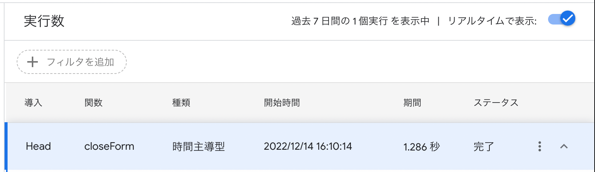

Google Form はデフォルトでは回答の締め切り時刻を設定することができません。
そこで、 Google App Script（GAS）を活用し、締め切り時刻を過ぎたら自動で回答を締め切る機能を開発します。

## 手順

### コードを入力する

Google App Script を使用するために、管理画面右上の三点リーダをクリックし、スクリプトエディタを選択します。


スクリプトエディタに以下のコードを入力し、保存します。

```js
function closeForm() {
  const f = FormApp.getActiveForm();
  f.setAcceptingResponses(false);
}
```

保存後に「実行」ボタンをクリックし、デバックしてみましょう。

:::caution
「実行」ボタンをクリックした際、「承認が必要です」というダイアログが表示されることがあるので、画面に従って承認を行ってください。
:::

実行されて無事に解答が締め切られていれば成功です。

### トリガーを設定する

では、作成したスクリプトを実行するため、トリガーを追加します。
サイドバーを開いて、「トリガー」画面に移動し、「トリガーを追加」から設定を行います。


`イベントのソースを選択`を`時間主導型`に、`時間ベースのトリガーのタイプを選択`を`特定の日時`にした上で、回答を締め切る時刻を入力し、保存すれば準備完了です。

## 実行例

文化祭のテーマ募集用フォームの回答締め切りを `2022年12月14日16時10分`に設定したところ、以下のように時間通り実行され、無事自動で解答が締め切られました。



このように、フォームに回答期限を設けたい際にやってみてはいかがでしょうか。
