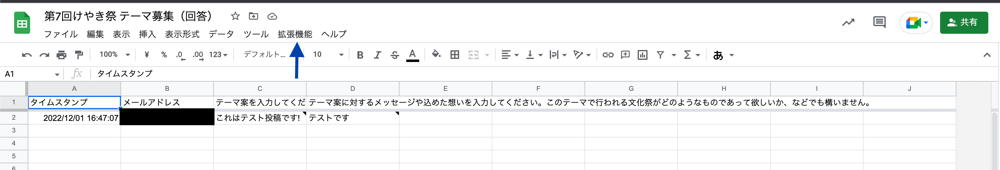
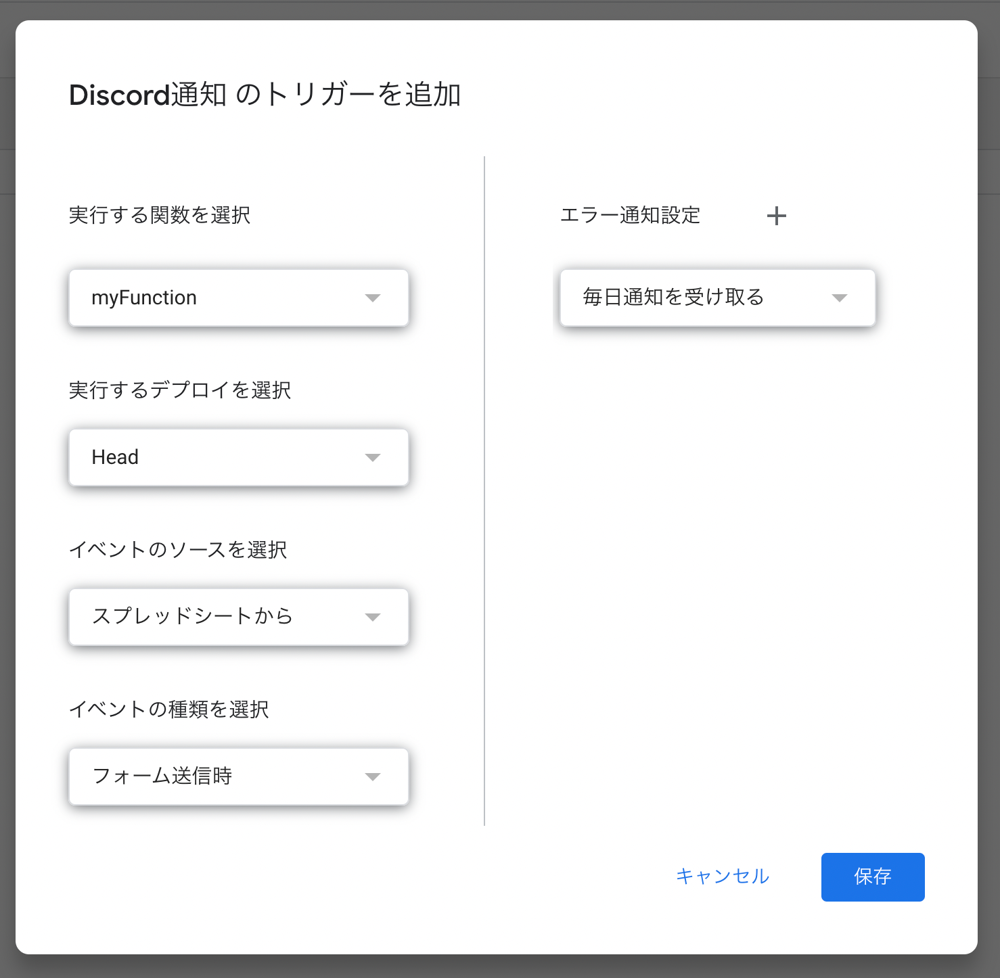
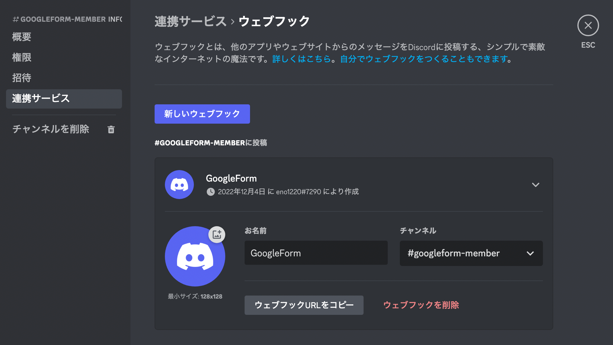

Google Form は Google の提供するアンケートアプリです。詳細の説明は省略し、文化祭運営に便利な機能を紹介します。
なお、今回の説明では茨城県教育委員会の提供するアカウントを使用していることを前提とします。

### 回答を制限する


Google Form では、回答するユーザーを制限したり、回答数を制限することができます。たとえば、上の画像で `茨城県教育委員会 と信頼できる組織のユーザーに限定する`を ON にした場合、茨城県教育委員会（学校）に関連するアカウントでのみ回答をすることができ、個人的なアカウントからの回答をブロックすることができます。
なお、注意として、外部向けにフォームを作成する際にこれを ON にしていると外部の方が回答できなくなってしまうので、注意してください。

また、`回答を 1 回に制限する`を ON にすると回答を 1 回に制限することができます。テストの解答や一人 1 度のみの回答を期待したいフォームを作成する際に使用すると良いでしょう。この場合、`回答の編集を許可する`を ON にしなければ、回答は 1 度きりとなります。

### 回答の内容を制限する


Google Form では各質問に対し、制限をかけることができます。「必須」を選択した場合はユーザー当該質問への回答を強制させることができます。

「回答の検証」を選択すると、入力される内容に対して制限をかけることができ、例えば文字数を指定することができる他、正規表現で入力をチェックすることができます。

### 回答がきたら Discord に通知する

webhook という仕組みを用いて、 Google Form に回答があった場合に Discord に通知するようにします。
ここでは、回答の内容を合わせて通知してみようと思います。


まず、「回答」タブを表示し、右上にある緑のボタンをクリックして「スプレッドシート」を開きます。
このスプレッドシートには Form で回答された内容の一覧が収集されています。



スプレッドシートを開いたら、次に「拡張機能」→「App Script」をクリックして、Google App Script を開きます。
Google App Script を開くとコードを記述できる箇所があるので、以下のコードを貼り付けます。

```js
function myFunction() {
  // Discordから取得したURLを貼り付ける
  const webhookURL = "";

  var spreadsheet = SpreadsheetApp.getActiveSpreadsheet();
  var e = spreadsheet.getSheetByName("ans");
  const last = e.getLastRow();

  // Discordに表示する文章.
  let messageBody = "";

  // 送信例（適宜変更すること）
  messageBody += `----------\n`;
  messageBody += `${e.getRange(last, 1).getDisplayValue()}\n`;
  messageBody += `【テーマ案】\n`;
  messageBody += `${e.getRange(last, 3).getDisplayValue()}\n`;
  messageBody += `【テーマに込めた意図】\n`;
  messageBody += `${e.getRange(last, 4).getDisplayValue()}\n`;
  messageBody += `----------\n`;

  const message = {
    content: messageBody,
    tts: false,
  };

  const param = {
    method: "POST",
    headers: { "Content-type": "application/json" },
    payload: JSON.stringify(message),
  };

  UrlFetchApp.fetch(webhookURL, param);
}
```

`webhookURL`は後述するとして、それ以外のコードを解説します。

```js
var spreadsheet = SpreadsheetApp.getActiveSpreadsheet();
var e = spreadsheet.getSheetByName("ans");
const last = e.getLastRow();
```

ここでは、スプレッドシートから情報を取得するための前処理を実施しています。
サンプルコードでは`ans`と呼ばれるスプレッドシートから情報を取得するように設定ているため、状況に合わせてシートの名称を変えるか、`getSheetByName`の引数を変更してください。
3 行目では、シートで現在使用されている一番下の行を検索しています。これは、Google Form で回答がなされた場合、最新の回答がシートの最下部に追加されるためです。

```js
// Discordに表示する文章.
let messageBody = "";

// 送信例（適宜変更すること）
messageBody += `----------\n`;
messageBody += `${e.getRange(last, 1).getDisplayValue()}\n`;
messageBody += `【テーマ案】\n`;
messageBody += `${e.getRange(last, 3).getDisplayValue()}\n`;
messageBody += `【テーマに込めた意図】\n`;
messageBody += `${e.getRange(last, 4).getDisplayValue()}\n`;
messageBody += `----------\n`;
```

ここでは Discord に通知する際に表示するテキストを作成しています。スプレッドシートの各セルの内容は、`e.getRange(a,b).getDisplayValue()`で取得することができます。（ただし、`a`は行、`b`は列を表します。）

その上で送信内容を作成し、実際に送信を行います。


さて、コードを書くことができたら、サイドバーから「トリガー」を選択し、トリガーを追加しましょう。ここで、「イベントを選択」を「フォーム送信時」に設定しましょう。


最後に、`webhookURL`を設定します。Discord でチャンネルを作成しておき、「チャンネルの設定」→「連携サービス」から「新規 webhook を作成」をクリックしましょう。
作成したら、URL をコピーしてコードに貼り付けましょう。

お疲れ様でした。これで、完成です!!

Google Form に回答がなされた場合、以下のような内容が送信されるはずです。

```text
---
2022/12/01 16:47:07
【テーマ案】
テスト投稿です
【テーマに込めた意図】
これはテスト投稿です。
---
```
