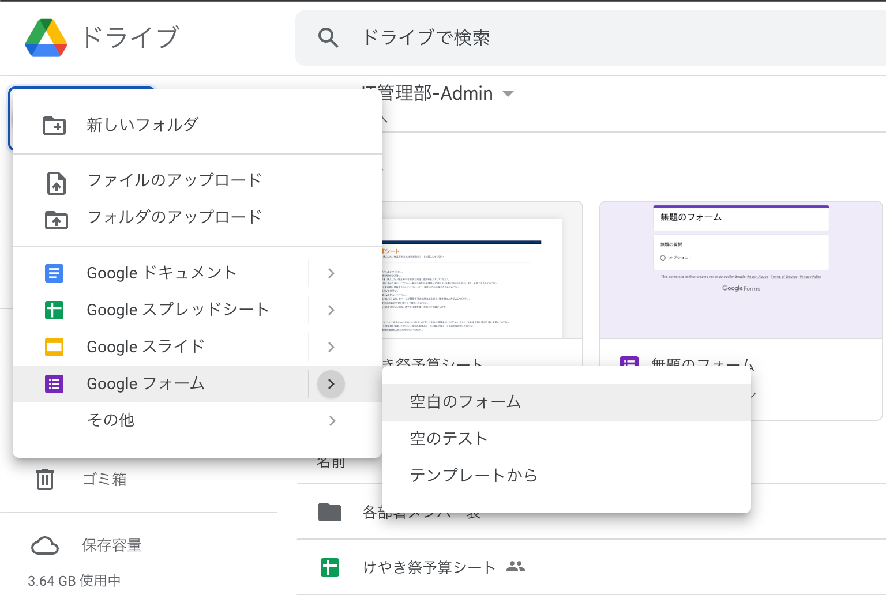
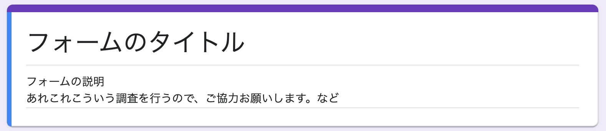
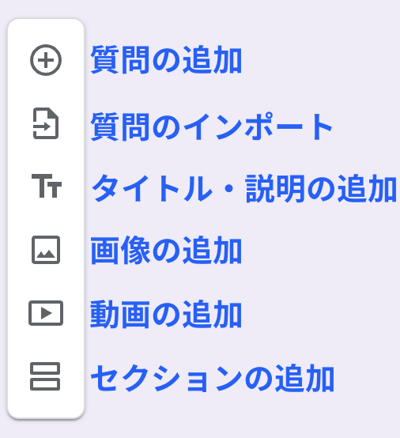
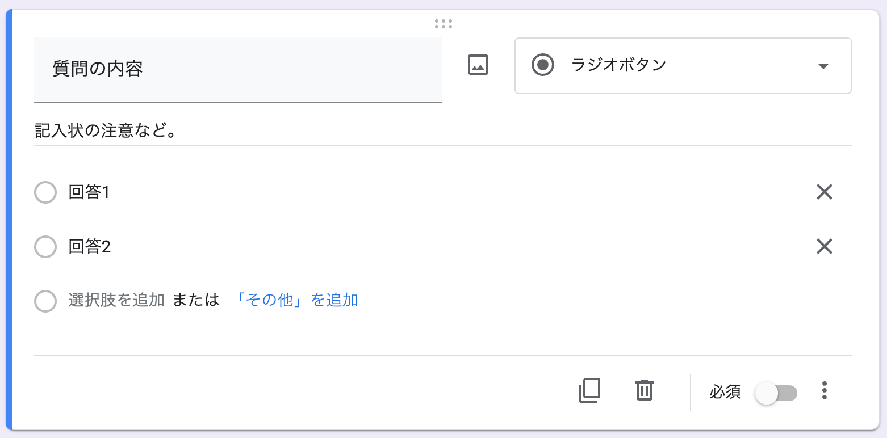
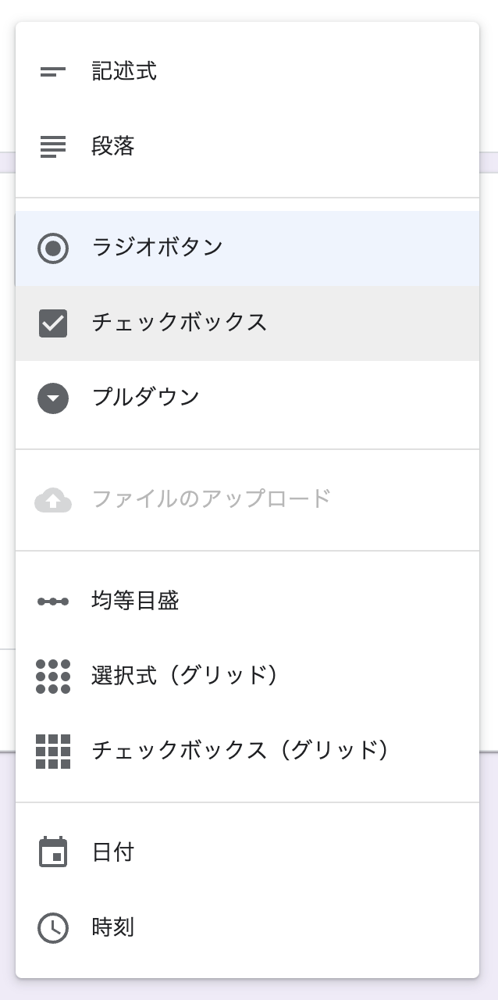
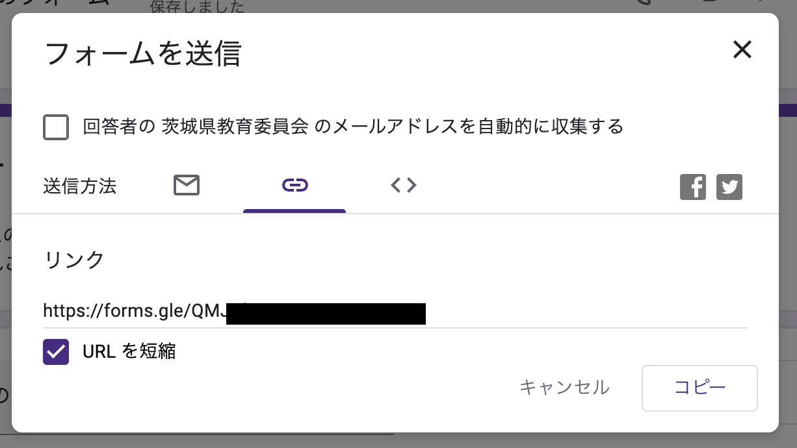
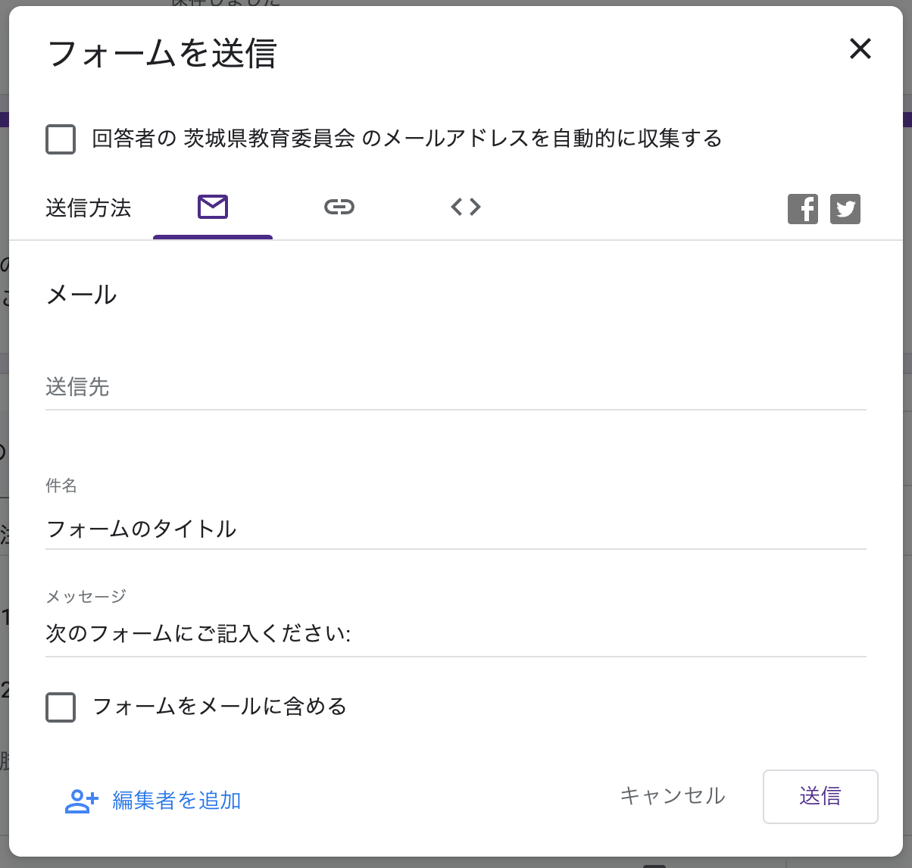
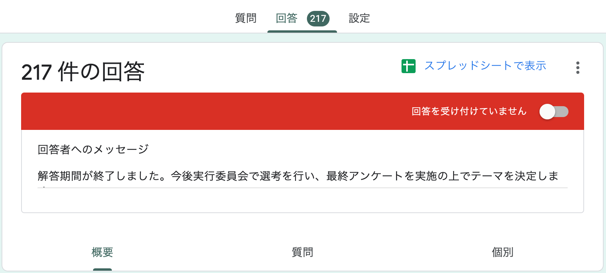
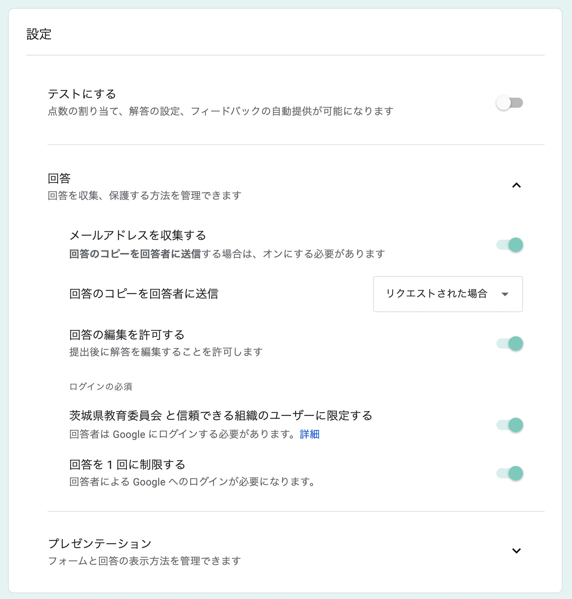
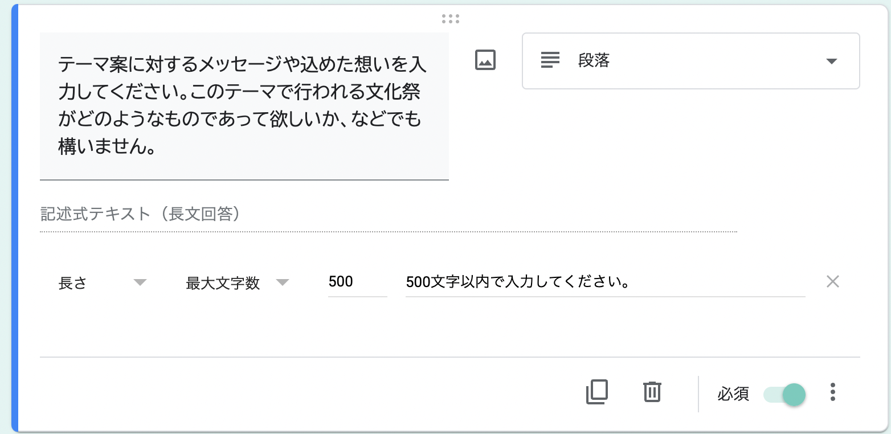

Google Form は Google の提供するアンケートアプリです。
なお、今回の説明では茨城県教育委員会の提供するアカウント（`ibk.ed.jp`で終わるメールアドレス）を使用していることを前提とします。

## 基本的な使い方

### 新規作成

[Google Drive](https://drive.google.com)を開いたら、右上の「新規」ボタンをクリックし、Google Form を選択しましょう。
空白のフォーム・空のテスト・テンプレートから、の 3 種類から選択できるので、用途に合ったものを選択しましょう。
テンプレートには公式に提供されているものにはスケジュール確認や申し込み、アンケートなど 17 種類あるほか、茨城県教育委員会によって提供されているテンプレートもあります。

### タイトルと説明

一番最初のパーツには、フォームの名前と説明を記述する場所があります。
タイトルは簡潔で分かりやすいものに、説明には詳細や締切日、記入上の注意点を書きましょう。
実施している部署名（例:IT 管理部）やお願いの文言等あると良いでしょう。

### パーツ

いくつかのパーツを追加していくことで作成することができます。
質問のほかに、いくつかのコンテンツ（画像・動画）やテキスト（タイトルパーツと同様なもの）、セクション（改ページ）も追加することができます。

### 質問/選択肢の作成

質問パーツを追加したら、内容を記入していきます。
質問に対しては画像を挿入することができるほか、右下の「必須」をオンにすると、回答を必須にすることが可能です。
右下の三点マークから「説明」を選択すると説明文を追加できます。記入上の注意などを記述すると良いでしょう。また、「回答に応じてセクションを移動」を選択すると、回答によって質問内容を変えることができます。

回答形式はいくつか種類があります。用途に合わせて決定しましょう。

- 記述式 : 一文程度の短い文章を記載するとき
- 段落式 : 段落を分けるような、もしくは長い文章を記載するとき
- ラジオボタン : 一つのみ回答を選択するとき
- チェックボックス : 複数の回答を選択するとき
- プルダウン : プルダウン形式で選択する時
- 均等メモリ : 例えば複数段階での評価をとるとき
- 選択式（グリッド） : 行・列に分けて入力してほしい時
- チェックボックス（グリッド）: 各項目に対して一つ以上の回答をしてほしい時

### デザインの変更

ヘッダー右の 🎨 （パレット）をクリックすると、デザインをカスタマイズすることができます。
テキストスタイルのほか、色彩を変更することができます。

:::note

フォントの中に「BIZ UDP ゴシック」というものがあり、これはユニバーサルデザインに配慮したフォントです。
個人的にはこちらの使用をお勧めします。

:::

### プレビュー

ヘッダー右の 👁 （目）をクリックすると、プレビューを確認することができます。

### フォームの公開

ヘッダー右の 紙飛行機のアイコンをクリックしてフォームを公開します。

メールやリンクの形式でフォームを公開することができます。
なお、リンクの URL は短縮することができるので、掲示物に貼り付ける場合や QR コードを作成する場合には短縮しておくと良いでしょう。
後述する`茨城県教育委員会 と信頼できる組織のユーザーに限定する`を ON にした場合 URL を送信し、回答することは可能ですが、学校から提供された Google アカウントでログインしている必要があります。

### 結果の確認

フォームへの回答の結果は、「回答」タブから確認できます。
グラフやリスト形式で結果を確認できるほか、各回答者の個別の回答を確認することができます。
詳細が確認したい場合、緑色のアイコンからスプレッドシートに結果をエクスポートでき、自動で回答が追加されていきます。

「回答」タブからはフォームへの回答を締め切ることができるほか、右上の三点リーダからは新しい回答があった場合にメール通知を得たり、リンクを削除（これまでの URL を削除し使用できないようにする）することができます。

TODO

- デザイン・プレビューの詳細な説明 
- セクションの説明と回答による切り替えの方法 
- 共同編集者の追加方法 
- テンプレート作成
- メール通知
- スプレッドシート

## 回答を制限する

### 回答できるユーザーを制限する

Google Form では、回答するユーザーを制限したり、回答数を制限することができます。たとえば、上の画像で `茨城県教育委員会 と信頼できる組織のユーザーに限定する`を ON にした場合、茨城県教育委員会（学校）に関連するアカウントでのみ回答をすることができ、個人的なアカウントからの回答をブロックすることができます。
なお、注意として、外部向けにフォームを作成する際にこれを ON にしていると外部の方が回答できなくなってしまうので、注意してください。

:::note

正確に言えば、茨城県教育委員会が契約している Google Workspace for Education に紐づけられたアカウントのみが`茨城県教育委員会 と信頼できる組織のユーザーに限定する`を設定した場合に回答することができます。

茨城県教育委員会は、すべての茨城県立高校・中学校・中等教育学校に所属する生徒・教員にこの Google Workspace for Education に紐づけられたアカウントを配布しているので、回答を制限した場合でも他校の生徒や教員でもフォームに回答することができます。

ですので、必ずしも古河中等の生徒のみが回答できるようになっている、というわけではありませんので取り扱いには注意してください。できれば、`メールアドレスを収集する`をオンにするなどして、本校の生徒であることを確認してください。

:::

### 回答回数を制限する

`回答を 1 回に制限する`を ON にすると回答を 1 回に制限することができます。テストの解答や一人 1 度のみの回答を期待したいフォームを作成する際に使用すると良いでしょう。この場合、`回答の編集を許可する`を ON にしなければ、回答は 1 度きりとなります。

### 回答の内容を制限する

Google Form ではそれぞれの質問に対し、制限をかけることができます。それぞれの質問の右下にある「必須」のボタンをオンにした場合はユーザー当該質問への回答を強制させることができます。

「回答の検証」を選択すると、入力される内容に対して制限をかけることができ、例えば回答する文字数を指定することができる他、正規表現で入力された内容をチェックすることができます。また、チェックボックスに対しては選択する個数を制限することもできます。
